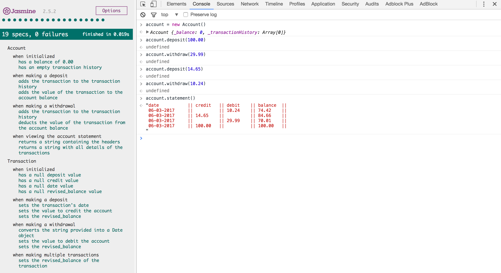

# Bank Challenge

I have been asked to design and produce a project which mimics user's making deposits and withdrawals from a bank account.  In addition, the user should also be able to see a bank statement showing recent transactions.  

## User Stories

```
As a User
So that I can save my money
I want to be able to make a deposit into my account.

As a User
So that I can spend my money
I want to be able to make a withdrawal from my account.

As a User
So that I can easily manage my finances
I want to be able to see a printed account statement.
```
## Technology

I have created this project using Javascript and Jasmine testing suite.  

## Tests

In order to run the tests, navigate to the 'jasmine' directory within the app and run the command ($ open SpecRunner.html).

## Using the Application

In order to run the application:

* Run the command '$ open SpecRunner.html' which will open the application in your default internet browser.

* Open your browser's development tools and click on the 'console' tab.

* Within the console, run the following commands:

```
To create an account: 'accountName = new Account()'

To make a deposit: 'accountName.deposit(value)'

To make a withdrawal: 'accountName.withdraw(value)'

To see a statement: 'accountName.statement()'
```
The screenshot below shows an example of the application in use:


